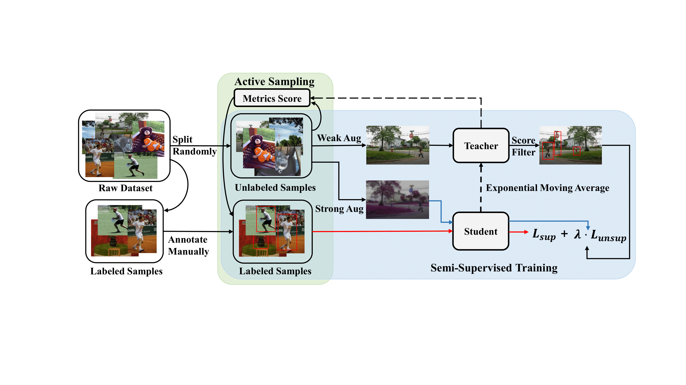

# Active Teacher for Semi-Supervised Object Detection
This is an official implementation for CVPR2022 paper ["Active Teacher for Semi-Supervised Object Detection"](https://openaccess.thecvf.com/content/CVPR2022/papers/Mi_Active_Teacher_for_Semi-Supervised_Object_Detection_CVPR_2022_paper.pdf). It includes the code for Active Teacher on Object Detection task. The performance on COCO, PASCAL VOC, SODA is reported in this repo.

<!-- by [Peng Mi](), [Jianghang Lin](https://github.com/HunterJ-Lin), [Yiyi Zhou](), [Yunhang Shen](), [Gen Luo](), [Xiaoshuai Sun](), [Liujuan Cao](), [Rongrong Fu](), [Qiang Xu](), [Rongrong Ji](). -->
<!-- Conference on Computer Vision and Pattern Recognition (CVPR) 2022 Paper.</br> -->

## Introduction
The overall of our **Active Teacher**. 
<p align="center">

</p>


## Installation

- Install **detectron2** following the [instructions](https://detectron2.readthedocs.io/tutorials/install.html).

- Install **Active Teacher** via pip:
```
python3 -m pip install -e .
```

## Dataset Preparation

### Expected dataset structure for COCO detection:
```
coco/
  annotations/
    instances_{train,val}2017.json
  {train,val}2017/
    # image files that are mentioned in the corresponding json
```

### Expected dataset structure for Pascal VOC:
```
VOC20{07,12}/
  Annotations/
  ImageSets/
    Main/
      trainval.txt
      test.txt
      # train.txt or val.txt, if you use these splits
  JPEGImages/
```

### Custom dataset
[Use Custom Datasets](https://detectron2.readthedocs.io/tutorials/datasets.html) gives a deeper dive on how to use `DatasetCatalog` and `MetadataCatalog`, and how to add new datasets to them.

## Training (10% label data for example)
### Step 0、Generate 5% label data partition
```
python tools/generate_random_data_partition.py --random-file dataseed/COCO_supervision.txt --random-percent 5.0 --datasets "coco_2017_train,"
```

### Step 1、Train a pick model on 5% random data
```
mkdir temp
mkdir temp/coco
mkdir results
mkdir results/coco
mkdir dataseed/coco_pick

python tools/train_net.py \
      --num-gpus 8 \
      --config configs/coco/faster_rcnn_R_50_FPN_sup5_run1.yaml \
       SOLVER.IMG_PER_BATCH_LABEL 16 SOLVER.IMG_PER_BATCH_UNLABEL 16 OUTPUT_DIR output/coco/faster_rcnn_R_50_FPN_sup5_run1_16bs
```

### Step 2、Use the trained model from step 1 to get the indicator file of the dataset
```
python tools/inference_for_active_pick.py \
    --static-file temp/coco/static_by_random5.json \
    --model-weights output/coco/faster_rcnn_R_50_FPN_sup5_run1_16bs/model_best.pth \
    --config configs/coco/faster_rcnn_R_50_FPN_sup5_run1.yaml \

python tools/active_pick_evaluation.py \
    --static-file temp/coco/static_by_random5.json \
    --indicator-file results/coco/5random_maxnorm
```

### Step 3、Use the indictor file from step 2 to generate pick data and merge random data
```
python tools/generate_pick_merge_random_data_partition.py \
    --random-file dataseed/COCO_supervision.txt \
    --random-percent 5.0 \
    --indicator-file results/coco/5random_maxnorm.txt \
    --pick-percent 5.0 \
    --reverse True \
    --save-file dataseed/coco_pick/pick_maxnorm5+random5.txt
```

### Step 4、Train a model from scratch using the 10% data partition from step 3
```
python tools/train_net.py \
      --num-gpus 8 \
      --config configs/coco/faster_rcnn_R_50_FPN_sup10_run1.yaml \
       SOLVER.IMG_PER_BATCH_LABEL 16 SOLVER.IMG_PER_BATCH_UNLABEL 16 OUTPUT_DIR output/coco/faster_rcnn_R_50_FPN_sup10_run1_16bs DATALOADER.RANDOM_DATA_SEED_PATH dataseed/coco_pick/pick_maxnorm5+random5.txt

```

## Evaluation
```
python train_net.py \
      --eval-only \
      --num-gpus 8 \
      --config configs/coco/faster_rcnn_R_50_FPN_sup10_run1.yaml \
       SOLVER.IMG_PER_BATCH_LABEL 16 SOLVER.IMG_PER_BATCH_UNLABEL 16 MODEL.WEIGHTS output/coco/faster_rcnn_R_50_FPN_sup10_run1_16bs/model_final.pth
```

## Results
- The results on **different datasets** is shown as below:

For PASCAL VOC, the trainset includes `voc07-trainval, voc12-trainval`.The model is evaluated on `voc07-test`.

<table border="0" width="800">
<tr>
	<td width="25%" align="center"> <b> Models </b> </td>
	<td width="25%" align="center"> <b> Datasets </b> </td>
	<td width="15%" align="center"> <b> Labels </b> </td>
	<td width="25%" align="center"> <b> Supervision(mAP) </b> </td>
	<td width="25%" align="center"> <b> Ours(mAP) </b> </td>
</tr>
	
<tr>
	<td width="25" align="center" rowspan="9"> Res50-FPN</td>
	<td width="25%" align="center" rowspan="5"> COCO </td>
	<td width="15%" align="center"> 1% </td>
	<td width="25%" align="center" rowspan="5"> 37.63 </td>
	<td width="25%" align="center"> 22.20 </td>
</tr>
<tr>
	<td width="15%" align="center"> 2% </td>
	<td width="25%" align="center"> 24.99 </td>
</tr>
<tr>
	<td width="15%" align="center"> 5% </td>
	<td width="25%" align="center"> 30.07 </td>
</tr>
<tr>
	<td width="15%" align="center"> 10% </td>
	<td width="25%" align="center"> 32.58 </td>
</tr>
<tr>
	<td width="15%" align="center"> 20% </td>
	<td width="25%" align="center"> 35.49 </td>
</tr>

<tr>
	<td width="25%" align="center" rowspan="3"> VOC07+12 </td>
	<td width="15%" align="center"> 5% </td>
	<td width="25%" align="center" rowspan="3"> 48.62 </td>
	<td width="25%" align="center"> 41.85 </td>
</tr>
<tr>
	<td width="15%" align="center"> 10% </td>
	<td width="25%" align="center"> 46.77 </td>
</tr>
<tr>
	<td width="15%" align="center"> 15% </td>
	<td width="25%" align="center"> 49.73 </td>
</tr>
	
<tr>
	<td width="25%" align="center"> SODA </td>
	<td width="15%" align="center"> 10% </td>
	<td width="25%" align="center"> 34.52 </td>
	<td width="25%" align="center"> 33.32 </td>
</tr>
</table>
	
## Citing Active Teacher

If you find Active Teacher useful in your research, please consider citing:

```
@InProceedings{ActiveTeacher_2022_CVPR,
	author = {Mi, Peng and Lin, Jianghang and Zhou, Yiyi and Shen, Yunhang and Luo, Gen and Sun, Xiaoshuai and Cao, Liujuan and Fu, Rongrong and Xu, Qiang and Ji, Rongrong},
	title = {Active Teacher for Semi-Supervised Object Detection},
	booktitle = {The IEEE Conference on Computer Vision and Pattern Recognition (CVPR)},
	year = {2022},
}   
```

## License

Active Teacher is released under the [Apache 2.0 license](LICENSE).

## Acknowledgement
-   [STAC](https://github.com/google-research/ssl_detection)
-   [unbiased teacher](https://github.com/facebookresearch/unbiased-teacher)
-   [detectron2](https://github.com/facebookresearch/detectron2)
